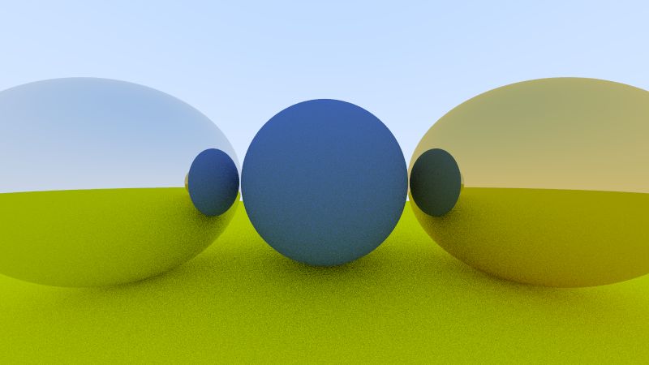
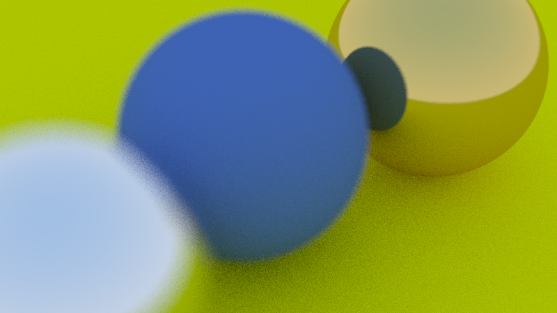

<h1 align="center">Ray Tracing in One Weekend</h1>

<div align="center">
 <a href="https://github.com/niklasmedinger/ray-tracing-weekend/actions/workflows/CI.yml">
        
 </a>
 |
 <a href="https://github.com/niklasmedinger/ray-tracing-weekend/actions/workflows/Bencher.yml">
        
 </a>
</div>

This is my Rust implementation of the ray tracer developed in the
[_Ray Tracing in One Weekend_](https://raytracing.github.io/books/RayTracingInOneWeekend.html)
book series. The goal of this project is to learn a bit about ray tracing, Rust,
and benchmarking in Rust.

## Rendered Example Scenes

Here a few selected scenes from the book series rendered with this implementation.

|  |
|:--:|
| *The final scene of the first book.* |

--------------------------------------------------------------------------------


|  |
|:--:|
| *A scene with a lambertian sphere in the center and two metal spheres left and right of it.* |

--------------------------------------------------------------------------------

|  |
|:--:|
| *A scene with a lambertian sphere in the center, a  metal sphere on the left, and a dieletric sphere on the right. The dieletric sphere contains another dieletric sphere, modelling a hollow glass sphere with air inside.* |

--------------------------------------------------------------------------------

|  |
|:--:|
| *The scene with two metal spheres from an alternative viewpoint.* |


--------------------------------------------------------------------------------

|  |
|:--:|
| *The same scene with defocus (i.e., depth of field) and a smaller field-of-view.* |


To render the scenes yourself, install [Rust](https://www.rust-lang.org/tools/install) and use
```
cargo run --example scene > scene.ppm --release
```
to render the file `scene` in the example folder into the file `scene.ppm`.
Take a look at the `./examples` folder for sample scenes. Use an image viewer of your choice
which can view `.ppm` files or, if you have `convert` from [ImageMagick](https://imagemagick.org/script/convert.php) installed,
convert them to `.png` files via
```
convert scene.ppm scene.png
```

## Benchmarking
I used this project to experiment a bit with benchmarking in Rust. There are
four popular options for benchmarking in Rust: [libtest bench](https://doc.rust-lang.org/cargo/commands/cargo-bench.html), [Criterion](https://github.com/bheisler/criterion.rs) and [Iai](https://github.com/bheisler/iai), and [Divan](https://github.com/nvzqz/divan). Since libtest requires the nightly toolchain,
it is often not used in favor of crates like Criterion, Iai, and Divan, which
work on stable rust.

Both Criterion and Divan are statistics-driven benchmarking libraries which allow
their users to measure the latency and throughput of their projects. Iai is an
experimental one-shot benchmarking library that uses Cachegrind to measure
the cache accesses of your code. For futher information about the respective
libraries, I recommend their githubs, crate documentation, and, for Divan,
this [blogpost](https://nikolaivazquez.com/blog/divan/).

I ended up choosing Criterion and Iai due to their compatability with [Bencher](https://github.com/bencherdev/bencher);
another benchmarking tool I'm exploring in this project.

To bench the ray tracer, I'm using two macro benchmarks and two micro benchmarks:
* A complete render of the [_hollow\_glass_](./examples/hollow_glass.rs) scene.
* A complete render of a grid of spheres.
* A single pixel from the [_hollow\_glass_](./examples/hollow_glass.rs) scene.
* A single pixel from the grid of spheres scene.
See the [benches folder](./benches/) for the code of these benchmarks. Each
benchmark is executed with both Criterion and Iai.

To benchmark the code changes to the project, I use two approaches: 1) Relative
Continuous Benchmarking, and 2) Continuous statistical benchmarking. For 1),
I'm simply using Github Actions to checkout the current commit as well as its parent,
and then I first benchmark the parent and then compare it to the benchmarks of the
current commit. See [`CI.yml`](./.github/workflows/CI.yml). For 2),
I'm using [Bencher](https://github.com/bencherdev/bencher): A suite of continuous
benchmarking tools. Again, I'm using an [action](./.github/workflows/Bencher.yml)
to checkout my code and then use Bencher to execute my benchmarks on their
infrastructure. For each of the
benchmarks, Bencher tracks its results over time and is even able to issue
warnings should a degression occur. Here, you can see the projects [perf page](https://bencher.dev/perf/raytracing-weekend?key=true&reports_per_page=4&branches_per_page=8&testbeds_per_page=8&benchmarks_per_page=8&plots_per_page=8&reports_page=1&branches_page=1&testbeds_page=1&benchmarks_page=1&plots_page=1&report=ea8be702-fa4d-47df-9022-29dbdcc432af&branches=e272e4b9-7e97-46b2-a403-35e73893ef4f&testbeds=42132742-158d-4e64-8c2e-47984b27798f&benchmarks=2be6ef2c-5ce9-4dee-b05b-46d5f1b17f93%2C59bc6a68-248b-4f43-b79f-3d43bc4182be%2Ceeaef59b-700a-487e-9398-e3f1be99addd%2Caf955bb8-4aea-4f96-a726-e897781ab2b6&measures=dc59b5b0-d80d-485f-aa42-461f4fc4d0e3&start_time=1720967964000&end_time=1723559972000&clear=true),
where you can inspect the different measure over time yourself!

It also allows you to easily export automatically up-to-date images of these plots.
Here are some example plots:

| <a href="https://bencher.dev/perf/raytracing-weekend?key=true&reports_per_page=4&branches_per_page=8&testbeds_per_page=8&benchmarks_per_page=8&plots_per_page=8&reports_page=1&branches_page=1&testbeds_page=1&benchmarks_page=1&plots_page=1&branches=e272e4b9-7e97-46b2-a403-35e73893ef4f&testbeds=42132742-158d-4e64-8c2e-47984b27798f&measures=bd087070-50c6-40ff-aede-60d4fb58e39a&clear=true&tab=benchmarks&benchmarks=584d3db9-2f38-4302-8c61-83db3d791bb1%2C5cca1689-0371-4dde-a031-89a8b3b9b5a1"></a> |
|:--:|
| *Latency of the scene renders over time.* |

| <a href="https://bencher.dev/perf/raytracing-weekend?key=true&reports_per_page=4&branches_per_page=8&testbeds_per_page=8&benchmarks_per_page=8&plots_per_page=8&reports_page=1&branches_page=1&testbeds_page=1&benchmarks_page=1&plots_page=1&branches=e272e4b9-7e97-46b2-a403-35e73893ef4f&testbeds=42132742-158d-4e64-8c2e-47984b27798f&measures=bd087070-50c6-40ff-aede-60d4fb58e39a&clear=true&tab=benchmarks&benchmarks=cfd00ae8-da39-4567-aa91-05ae3e08e565%2C8b6e8ca9-0780-4998-80fd-dd4b76f7dea2"></a> |
|:--:|
| *Latency of the single pixel renders over time.* |

| <a href="https://bencher.dev/perf/raytracing-weekend?key=true&reports_per_page=4&branches_per_page=8&testbeds_per_page=8&benchmarks_per_page=8&plots_per_page=8&reports_page=1&branches_page=1&testbeds_page=1&benchmarks_page=1&plots_page=1&branches=e272e4b9-7e97-46b2-a403-35e73893ef4f&testbeds=42132742-158d-4e64-8c2e-47984b27798f&measures=b06ca7e4-e599-4b41-91b4-aea317107228&clear=true&tab=benchmarks&benchmarks=59bc6a68-248b-4f43-b79f-3d43bc4182be%2Caf955bb8-4aea-4f96-a726-e897781ab2b6"></a> |
|:--:|
| *Instructions executed for the scene renders over time.* |

| <a href="https://bencher.dev/perf/raytracing-weekend?key=true&reports_per_page=4&branches_per_page=8&testbeds_per_page=8&benchmarks_per_page=8&plots_per_page=8&reports_page=1&branches_page=1&testbeds_page=1&benchmarks_page=1&plots_page=1&branches=e272e4b9-7e97-46b2-a403-35e73893ef4f&testbeds=42132742-158d-4e64-8c2e-47984b27798f&measures=b06ca7e4-e599-4b41-91b4-aea317107228&clear=true&tab=benchmarks&benchmarks=2be6ef2c-5ce9-4dee-b05b-46d5f1b17f93%2Ceeaef59b-700a-487e-9398-e3f1be99addd"></a> |
|:--:|
| *Instructions executed for the single pixel renders over time.* |