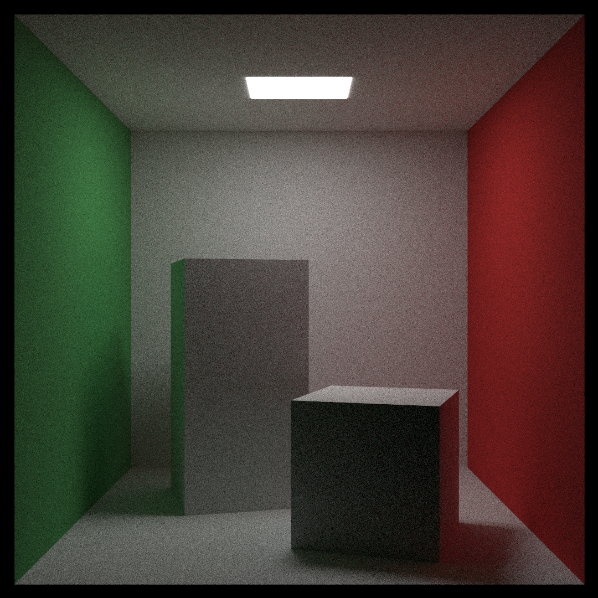

<h1 align="center">Ray Tracing in One Weekend</h1>

<div align="center">
 <a href="https://github.com/niklasmedinger/ray-tracing-weekend/actions/workflows/CI.yml">
        
 </a>
 |
 <a href="https://github.com/niklasmedinger/ray-tracing-weekend/actions/workflows/Bencher.yml">
        
 </a>
</div>

This is my Rust implementation of the ray tracer developed in the first two books
of the [_Ray Tracing in One Weekend_](https://raytracing.github.io/books/RayTracingInOneWeekend.html)
book series by Peter Shirley, Trevor David Black, and Steve Hollasch.
The goal of this project is to learn a bit about ray tracing, Rust,
and benchmarking in Rust.

## Rendered Example Scenes

Here a few selected scenes from the book series rendered with this implementation.
If you want to see more scenes, take a look [here](./SCENES.md).

|  |
|:--:|
| *The final scene of the first book.* |

--------------------------------------------------------------------------------

|  |
|:--:|
| *The final scene of the second book.* |

--------------------------------------------------------------------------------

|  |
|:--:|
| *The "Cornell Box". A scene that models the interaction of light between diffuse surfaces.* |

--------------------------------------------------------------------------------

|  |
|:--:|
| *A scene with a rectangle light source. The sphere and ground have a perlin texture.* |

--------------------------------------------------------------------------------

To render the scenes yourself, install [Rust](https://www.rust-lang.org/tools/install) and use
```
cargo run --example scene --release
```
to render the file `scene` in the example folder into the file `scene.png`.
Take a look at the `./examples` folder for sample scenes. For quicker renders
with a lower quality you need to adjust the settings of the `Camera` struct
via the `CameraBuilder`:

|  |
|:--:|
| *Initialization of the `Camera` struct via the `CameraBuilder` struct. Optional values are instantiated with default values when not explicitly provided. See the code [here](./src/camera.rs) or build the documentation of the proejct (`cargo doc --open --no-deps`) for an exhaustive list of options.* |


## Benchmarking
I used this project to experiment a bit with benchmarking in Rust. There are
four popular options for benchmarking in Rust: [libtest bench](https://doc.rust-lang.org/cargo/commands/cargo-bench.html), [Criterion](https://github.com/bheisler/criterion.rs) and [Iai](https://github.com/bheisler/iai), and [Divan](https://github.com/nvzqz/divan). Since libtest requires the nightly toolchain,
it is often not used in favor of crates like Criterion, Iai, and Divan, which
work on stable rust.

Both Criterion and Divan are statistics-driven benchmarking libraries which allow
their users to measure the latency and throughput of their projects. Iai is an
experimental one-shot benchmarking library that uses Cachegrind to measure
the cache accesses of your code. For futher information about the respective
libraries, I recommend their githubs, crate documentation, and, for Divan,
this [blogpost](https://nikolaivazquez.com/blog/divan/).

I ended up choosing Criterion and Iai due to their compatability with [Bencher](https://github.com/bencherdev/bencher);
another benchmarking tool I'm exploring in this project.

To bench the ray tracer, I'm using two macro benchmarks and two micro benchmarks:
* A complete render of the [_hollow\_glass_](./examples/hollow_glass.rs) scene.
* A complete render of a grid of spheres.
* A single pixel from the [_hollow\_glass_](./examples/hollow_glass.rs) scene.
* A single pixel from the grid of spheres scene.

See the [benches folder](./benches/) for the code of these benchmarks. Each
benchmark is executed with both Criterion and Iai.

To benchmark the code changes to the project, I use two approaches: 1) Relative
continuous benchmarking, and 2) Continuous statistical benchmarking. For 1),
I'm using a [Github Action](./.github/workflows/CI.yml) which first checks out the parent of the current commit and benchmarks it, and then checks out the current commit and benchmarks it too. This allows us to inspect the performance
difference of these two commits in the logs of the Github Action runs. For instance:

|  |
|:--:|
| *The output of Criterion and Iai for one of our benchmarks in CI. These benchmarks are run on both the current commit and the parent of the current commit. The percentages shown are relative from the parent commit to the current commit. I.e., a negative percentage indicates that the current commit is more performant on the benchmark.* |

For 2),
I'm using [Bencher](https://github.com/bencherdev/bencher): A suite of continuous
benchmarking tools. Again, I'm using an [action](./.github/workflows/Bencher.yml)
to checkout my code and then use Bencher to execute my benchmarks on their
infrastructure. For each of the
benchmarks, Bencher tracks its results over time and is even able to issue
warnings should a degression occur. Here, you can see the projects [perf page](https://bencher.dev/perf/raytracing-weekend?key=true&reports_per_page=4&branches_per_page=8&testbeds_per_page=8&benchmarks_per_page=8&plots_per_page=8&reports_page=1&branches_page=1&testbeds_page=1&benchmarks_page=1&plots_page=1&report=ea8be702-fa4d-47df-9022-29dbdcc432af&branches=e272e4b9-7e97-46b2-a403-35e73893ef4f&testbeds=42132742-158d-4e64-8c2e-47984b27798f&benchmarks=2be6ef2c-5ce9-4dee-b05b-46d5f1b17f93%2C59bc6a68-248b-4f43-b79f-3d43bc4182be%2Ceeaef59b-700a-487e-9398-e3f1be99addd%2Caf955bb8-4aea-4f96-a726-e897781ab2b6&measures=dc59b5b0-d80d-485f-aa42-461f4fc4d0e3&start_time=1720967964000&end_time=1723559972000&clear=true),
where you can inspect the different measure over time yourself!

It also allows you to easily export automatically up-to-date images of these plots.
Here are some example plots:

| <a href="https://bencher.dev/perf/raytracing-weekend?key=true&reports_per_page=4&branches_per_page=8&testbeds_per_page=8&benchmarks_per_page=8&plots_per_page=8&reports_page=1&branches_page=1&testbeds_page=1&benchmarks_page=1&plots_page=1&branches=e272e4b9-7e97-46b2-a403-35e73893ef4f&testbeds=42132742-158d-4e64-8c2e-47984b27798f&measures=bd087070-50c6-40ff-aede-60d4fb58e39a&start_time=1722754871000&end_time=1725346882000&clear=true&tab=benchmarks&benchmarks=5cca1689-0371-4dde-a031-89a8b3b9b5a1%2Ca47d4146-1f3e-4eb1-b01c-be86d29e9354%2C584d3db9-2f38-4302-8c61-83db3d791bb1"></a> |
|:--:|
| *Latency of the scene renders over time.* |

In this plot, we can see how the render time for our benchmark scenes evolved over time. The first major drop in rendering time is due to concurrent rendering of each pixel thanks to [Rayon](https://github.com/rayon-rs/rayon). This optimization is not part of the book series. Another optimization which is part of the book series is a _bounding volume hiearchy_ (BVH). In a nutshell, for each pixel, the ray tracer needs to _ask_ the objects in the scene whether the ray originating from this pixel hits the object. Without any optimization, this results in a linear amount of hit queries for each pixel. A simple idea to optimize this is to enclose each object in the scene with a _bounding volume_ which completely encloses it and then
create a hierarchy (e.g., a binary tree) of these bounding volumes. Instead of the objects the ray tracer then queries these bounding volumes and, if the bounding volume is not hit by the current ray, does not need query the objects inside the bounding volume.
As a result, the ray tracer only needs to  make a logarithmic amount of hit queries per pixel instead of a linear amount.

Unfortunately, this optimization did not decrease the latency of our benchmark scenes. In fact, the opposite is true! It increased the rendering time. This is the bump around the 24.08.24 (08/24/24, for you americans) that you can see in the plot. Soooo... did the optimization not work? Did I implement it incorrectly?

The answer is: No. The optimization works and it is implemented correctly (to the best of my knowledge), but our benchmark scenes do not show any performance increase because they do not contain enough objects! The additional book keeping that the BVH introduces does more harm than good. With the problem identified, let's solve it! I added another scene, the [_many scene_](./benches/criterion_many_scene.rs), which contains around ~900 spheres and first benchmarked it without the BVH and then with the BVH. And, as expected, we have a sharp decrease in rendering time from 109,21ms to 14,199ms! Awesome!

| <a href="https://bencher.dev/perf/raytracing-weekend?key=true&reports_per_page=4&branches_per_page=8&testbeds_per_page=8&benchmarks_per_page=8&plots_per_page=8&reports_page=1&branches_page=1&testbeds_page=1&benchmarks_page=1&plots_page=1&branches=e272e4b9-7e97-46b2-a403-35e73893ef4f&testbeds=42132742-158d-4e64-8c2e-47984b27798f&measures=bd087070-50c6-40ff-aede-60d4fb58e39a&clear=true&tab=benchmarks&benchmarks=cfd00ae8-da39-4567-aa91-05ae3e08e565%2C8b6e8ca9-0780-4998-80fd-dd4b76f7dea2"></a> |
|:--:|
| *Latency of the single pixel renders over time.* |

This plot shows the latency of the single pixel renders over time and, as we can see, it mostly increased throughout the project. The first small increases are due to code changes necessary to parallelize the pixel rendering. In a nutshell, switching from 'normal` reference counting (i.e., [Rc](https://doc.rust-lang.org/std/rc/struct.Rc.html)) to atomic reference counting ([Arcs](https://doc.rust-lang.org/std/sync/struct.Arc.html)) introduces some overhead. However, looking at the first plot, this overhead is well worth it for the rendering time of the scenes!

The second increase is due to the aforementioned BVH optimization. As explained earlier, our benchmark scenes actually perform worse with the optimization because it does not contain enough objects. I did not add a single pixel render of the _many scene_ I described earlier.

| <a href="https://bencher.dev/perf/raytracing-weekend?key=true&reports_per_page=4&branches_per_page=8&testbeds_per_page=8&benchmarks_per_page=8&plots_per_page=8&reports_page=1&branches_page=1&testbeds_page=1&benchmarks_page=2&plots_page=1&branches=e272e4b9-7e97-46b2-a403-35e73893ef4f&testbeds=42132742-158d-4e64-8c2e-47984b27798f&benchmarks=59bc6a68-248b-4f43-b79f-3d43bc4182be%2Caf955bb8-4aea-4f96-a726-e897781ab2b6&measures=b06ca7e4-e599-4b41-91b4-aea317107228&start_time=1724803200000&end_time=1725346882000&clear=true&tab=benchmarks"></a> |
|:--:|
| *Instructions executed for the scene renders over time.* |

Iai allows us to measure the instructions executed for our benchmarks. I only added this library/benchmarks late into the project, so we cannot see the impact of our optimizations.

| <a href="https://bencher.dev/perf/raytracing-weekend?key=true&reports_per_page=4&branches_per_page=8&testbeds_per_page=8&benchmarks_per_page=8&plots_per_page=8&reports_page=1&branches_page=1&testbeds_page=1&benchmarks_page=1&plots_page=1&branches=e272e4b9-7e97-46b2-a403-35e73893ef4f&testbeds=42132742-158d-4e64-8c2e-47984b27798f&benchmarks=2be6ef2c-5ce9-4dee-b05b-46d5f1b17f93%2Ceeaef59b-700a-487e-9398-e3f1be99addd&measures=b06ca7e4-e599-4b41-91b4-aea317107228&start_time=1724803200000&end_time=1725346882000&clear=true&tab=branches"></a> |
|:--:|
| *Instructions executed for the single pixel renders over time.* |

## Rust vs C++
The original implementation of the ray tracer developed throughout the book series is written in C++. However, I chose to implement my ray tracer in Rust. While a straightforward port of the C++ code
to Rust is possible, this would result in very un-idiomatic Rust code. Therefore, I chose make
minor changes to the code to make it more idiomatic. In this Section, I'll give a quick overview of
these changes.

### `bool` as a Return Value to Communicate Optional Results
The C++ interface for a hittable object looks like this:
```c++

class hittable {
  public:
    virtual ~hittable() = default;

    virtual bool hit(const ray& r, interval ray_t, hit_record& rec) const = 0;
};
```
The idea is that any implementation of the `hit` method writes to the `hit_record` that `rec`
points to if and only if the `hit` method returned `true`. Put simply: `hit` makes optional changes
to `rec` and uses a boolean to communicate whether a change occured.

For cases like this, Rust features the `Option<T>` type. It looks like this:
```Rust
pub enum Option<T> {
    None,
    Some(T),
}
```
The `None` variant encodes that no value of type `T` is present and the `Some(T)` variant
encodes that a value is present. Exactly what the C++ code wanted to implement but needed
to use booleans for! Here, my Rust version of the hittable interface:
```Rust
pub trait Hittable {
    /// Compute whether `ray` hits the `self` in [Interval] `ray_t`.
    fn hit(&self, ray: &Ray, ray_t: Interval) -> Option<HitRecord>;
}
```
This type signature communicates more clearly what is happening. If a hit occurs,
the function returns a `Some(HitRecord)` and, should not hit occur, it returns a `None`.

### Public Values in Structs to Avoid Constructors
Throughout the book series structs like the `Camera` evolve quite a bit. Naturally,
this means that they store more and more fields. It is standard practice to
initialize these fields in a constructor which, often, does nothing more
than passing on a few values it received when called. For instance, here is the
constructor for the `translate` class:
```C++
class translate : public hittable {
  public:
    translate(shared_ptr<hittable> object, const vec3& offset)
      : object(object), offset(offset)
    {
        bbox = object->bounding_box() + offset;
    }
}
```
The constructor simply forwards `object` and `offset` to internal fields and computes `bbox` 
from these arguments.

If we now extend the `translate` class, we have a problem: Every time we add a field, we have to
make a change to the constructor. Very annoying! Especially, if you are writing a book series which
incrementally extends the code!

To sidestep this issue, the C++ code makes quite a few fields public and assumes that the calling
code will set the values it needs. Here is an example of how the camera is set up for a rendering scene:
```C++
{
    // ...
    camera cam;

    cam.aspect_ratio      = 16.0 / 9.0;
    cam.image_width       = 400;
    cam.samples_per_pixel = 100;
    cam.max_depth         = 50;
    cam.background        = color(0.70, 0.80, 1.00);

    cam.vfov     = 20;
    cam.lookfrom = point3(13,2,3);  
    cam.lookat   = point3(0,0,0);
    cam.vup      = vec3(0,1,0);

    cam.defocus_angle = 0.6;
    cam.focus_dist    = 10.0;

    cam.render(world);
}
```