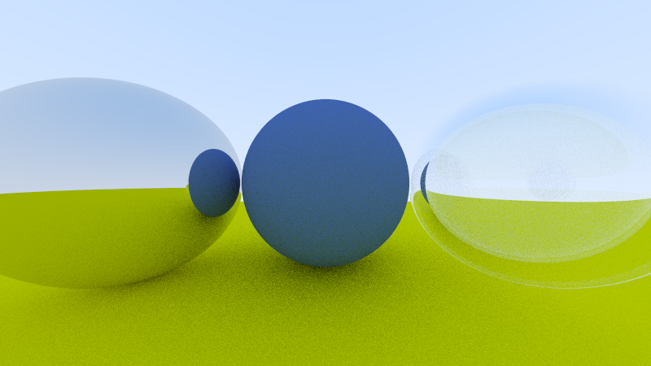
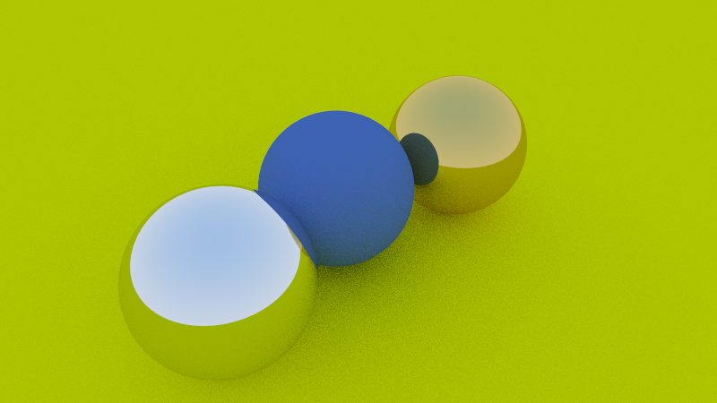

[](https://github.com/niklasmedinger/ray-tracing-weekend/actions/workflows/CI.yml)

# Ray Tracing in One Weekend
This is my Rust implementation of the ray tracer developed in the [_Ray Tracing in One Weekend_](https://raytracing.github.io/books/RayTracingInOneWeekend.html) book series.

## Rendered Scenes

Here a few selected scenes from the book series rendered with this implementation.

|  |
|:--:|
| *A scene with a lambertian sphere in the center and two metal spheres left and right of it.* |

--------------------------------------------------------------------------------

|  |
|:--:|
| *A scene with a lambertian sphere in the center, a  metal sphere on the left, and a dieletric sphere on the right. The dieletric sphere contains another dieletric sphere, modelling a hollow glass sphere with air inside.* |

--------------------------------------------------------------------------------

|  |
|:--:|
| *The scene with two metal spheres from an alternative viewpoint.* |


--------------------------------------------------------------------------------

|  |
|:--:|
| *The same scene with defocus (i.e., depth of field) and a smaller field-of-view.* |

--------------------------------------------------------------------------------

|  |
|:--:|
| *The final scene of the first book.* |

To render the scenes yourself, install [Rust](https://www.rust-lang.org/tools/install) and use
```
cargo run --example scene > scene.ppm --release
```
to render the file `scene` in the example folder into the file `scene.ppm`.
Take a look at the `./examples` folder for sample scenes. Use an image viewer of your choice
which can view `.ppm` files or, if you have `convert` from [ImageMagick](https://imagemagick.org/script/convert.php) installed,
convert them to `.png` files via
```
convert scene.ppm scene.png
```

## Benchmarking
TODO: Describe benchmarking infrastructure, i.e., criterion + iai + github action.
TODO: Setup bencher project to have continuous statistical benchmarking?
