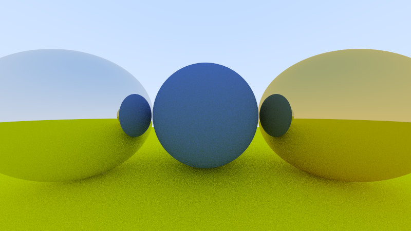
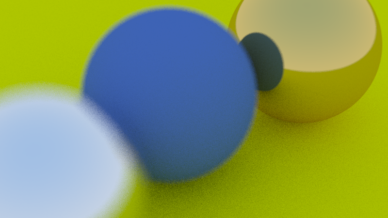

## Rendered Scenes

Here, we collect a random ensemble of renders from the first two books.

|  |
|:--:|
| *A scene with a lambertian sphere in the center and two metal spheres left and right of it.* |

--------------------------------------------------------------------------------

|  |
|:--:|
| *The scene with two metal spheres from an alternative viewpoint.* |

--------------------------------------------------------------------------------

|  |
|:--:|
| *The same scene with defocus (i.e., depth of field) and a smaller field-of-view.* |

--------------------------------------------------------------------------------

|  |
|:--:|
| *A scene with a lambertian sphere in the center, a  metal sphere on the left, and a dieletric sphere on the right. The dieletric sphere contains another dieletric sphere, modelling a hollow glass sphere with air inside.* |

--------------------------------------------------------------------------------

|  |
|:--:|
| *An image of the earth mapped onto a sphere.* |

--------------------------------------------------------------------------------

|  |
|:--:|
| *The "Cornell Box" where the two boxes inside of it are not solid but made of fog.* |

--------------------------------------------------------------------------------

|  |
|:--:|
| *Checkered texture mapped onto two spheres.* |

--------------------------------------------------------------------------------

|  |
|:--:|
| *The final scene of the first book with a checkered ground and an image of the earth mapped onto the back sphere.* |